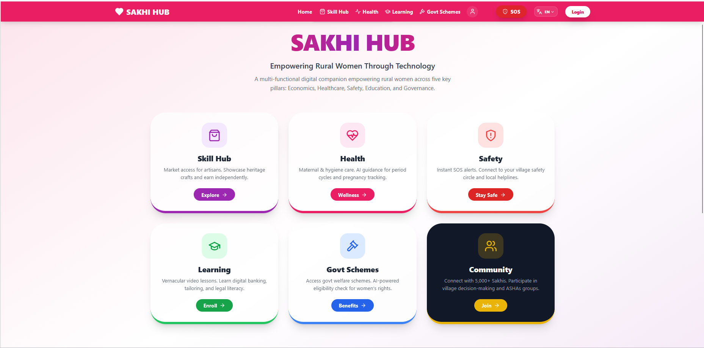
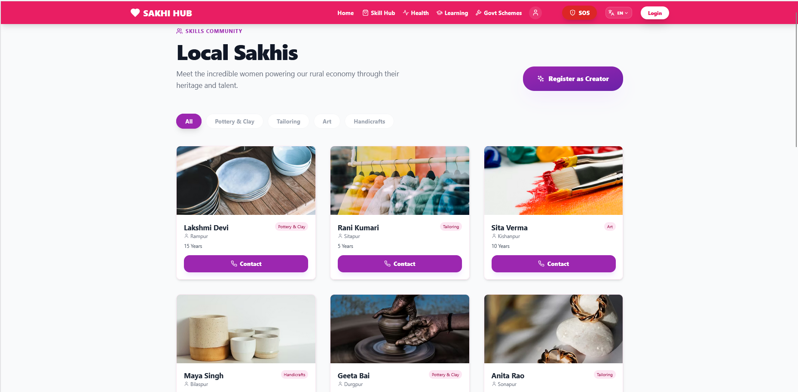
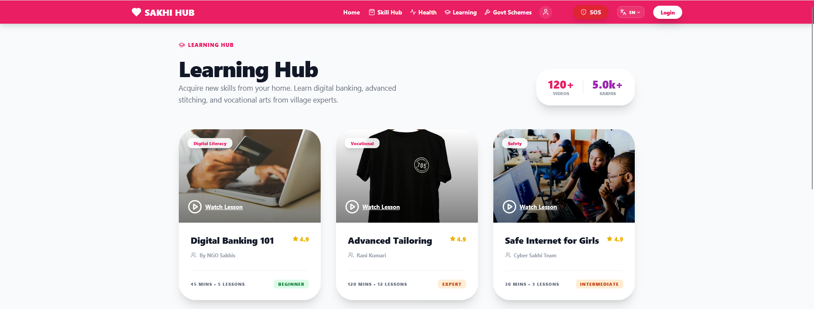

# 📸 How to Add Screenshots to README

## ✅ Quick Guide - 3 Steps

### Step 1: Take Screenshots

While your app is running at http://localhost:5173, take screenshots of:

1. **home.png** - Home dashboard with all 6 service cards
2. **skill-hub.png** - Skill Hub showing creator profiles
3. **health-assistant.png** - Health Assistant page with 3 bot options
4. **learning-hub.png** - Learning Hub with video courses
5. **schemes.png** - Government Schemes page
6. **safety.png** - Safety/SOS page

**How to take screenshots:**
- Windows: `Win + Shift + S` (Snipping Tool)
- Save each screenshot with the exact names above

### Step 2: Save Screenshots

Save all screenshots to: `D:\WOMEN-EMPOWERMENT\screenshots\`

Your folder should look like:
```
screenshots/
├── home.png
├── skill-hub.png
├── health-assistant.png
├── learning-hub.png
├── schemes.png
└── safety.png
```

### Step 3: Update README

Add these lines to README.md after each feature title:

**For Home Dashboard (after line ~40):**
```markdown
### 🏠 Home Dashboard
Beautiful, intuitive interface with quick access to all services.


```

**For Skill Hub (after line ~50):**
```markdown
### 🎨 Skill Hub - Creator Marketplace
Connect with talented rural artisans and browse handmade products.


```

**For Health Assistants (after line ~60):**
```markdown
### 🏥 AI Health Assistants
Privacy-focused AI chatbots for maternal and menstrual health guidance.


```

**For Learning Hub (after line ~75):**
```markdown
### 📚 Learning Hub
Skill development through vernacular video tutorials.


```

**For Government Schemes (after line ~85):**
```markdown
### 🏛️ Government Schemes
AI-powered eligibility checker for welfare programs.


```

**For Safety SOS (after line ~95):**
```markdown
### 🆘 Safety Network
One-touch SOS with instant alerts to safety circle.


```

### Step 4: Commit & Push

```bash
git add screenshots/ README.md
git commit -m "docs: Add application screenshots to README"
git push origin main
```

---

## 🎯 Result

After pushing, your README on GitHub will show actual screenshots of your application!

**Current Status:** README updated with detailed feature descriptions. Screenshots folder created and ready.

**To complete:** Just add the 6 screenshot images and update README with the image links above!
